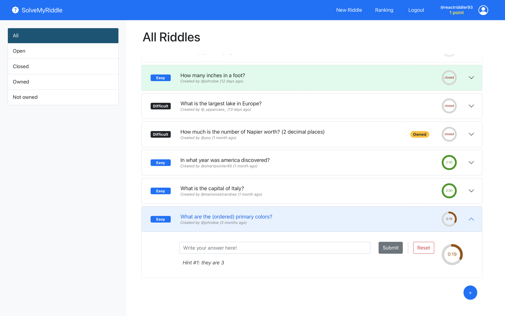

# Exam #2: "SolveMyRiddle"
## Student: s302219 MASTRANDREA MARIO 


## React Client Application Routes

- Route `/`: it contains the home page of the application, showing all the existing riddles from the youngest to the oldest, with a left-sidebar the user can use to filter them. Its purpose is to show the user the riddles that are available for him/her to solve, each one marked with the proper difficulty level and (if the user is logged in) showing the remaining time to solve it. Clicking to a riddle, a logged-in user can see additional details (e.g. replies by other users, correct solution, etc.) depending if he/she is the creator of the riddle or not, depending if the riddle is already solved or not and depending if he/she has already provided an own reply to the riddle or not. A top navbar allows to navigate through the different routes of the application and it shows (if any) the user's username and his actual score.
- Route `/:filter`: it contains the same home page of the application, but showing only a proper subset of the riddles depending on the filter parameter. The filter parameter can be `all`, `open`, `closed`, `owned` (if user is logged-in) and `not-owned` (if user is logged-in).
- Route `/login`: it contains the login page of the application, showing a form to log in the user, and the top navbar to navigate through the different routes of the application. If the user is already logged-in, he/she is redirected to the home page.
- Route `/addriddle`: it contains the add riddle page of the application, showing a form to add a new riddle, and the top navbar to navigate through the different routes of the application. If the user is not logged-in, he/she is redirected to the login page. The form contains the fields for adding all the riddle's details: question, answer, difficulty level, duration (in sec), and two hints.
- Route `/ranking`: it contains the ranking page of the application, showing the top-3 users with the highest scores and the top navbar to navigate through the different routes of the application. This is the only page that is available in the same way for both logged-in and not logged-in users.


## Server APIs

*Authentication APIs*

- GET `/api/sessions/current`
  - description: returns the current session of the user, if any
  - response body: a json user object containing his id and username
- POST `/api/login`
  - description: logs in the user if the given username and password are correct, creating a new session
  - request body: a json object containing the username and password inserted by the user
  - response body: json user object containing his id and username, if the login was successful, or an object with an error message otherwise
- DELETE `/api/logout`
  - description: performs the logout of the user, destroying the current session
  - request body: *none*
  - response body: *none* if the logout was successful, or an object with an error message otherwise

*Riddles and replies APIs*

- GET `/api/riddles/filter/:filter`
  - description: it returns all the riddles object specified by the filter parameter. Each riddle object contains all its specific information, depending on the user's status (if he/she is logged-in or not) and on the riddle's status (if it is owned or not by the user, if it is open or closed, if the user has already replied to that riddle yet or not, if there is a winner or not, etc.).
  - request parameter `filter`: it can be `all`, `open`, `closed`, `owned` (if user is logged-in) and `not-owned` (if user is logged-in)
  - request body: an array of json objects, each one representing a riddle object and with the proper information, or a json object with an error message if the request was not successful
  
   *Example of an open riddle object returned to a not authenticated user*
   ```json
   {
      "id": 15,
      "question": "What has many keys but can’t open a single lock?",
      "difficulty": "average",
      "open": true,
      "owned": false
   }
   ```

   *Example of the same open riddle object returned to an authenticated user*
   ```json
   {
      "id": 15,
      "question": "What has many keys but can’t open a single lock?",
      "difficulty": "average",
      "deadline": null,    // 'null' if no one has replied yet, or a ISO-8601 date format if someone has replied yet
      "duration": 130,
      "ownerUsername": "_uppercase_",
      "birth": "2022-07-13T23:49:56.812Z",   // ISO-8601 date format
      "open": true,
      "owned": false
   }
   ```

   *Example of a closed riddle object not owned by the (authenticated)user, and whose he is the winner*
   ```json
   {
      "id": 12,
      "question": "I have four legs, a back, but no head. What am I?",
      "difficulty": "average",
      "answer": "a chair",
      "ownerUsername": "smartpointer85",
      "birth": "2022-07-12T10:30:00.000Z",
      "open": false,
      "owned": false,
      "userReply": "a chair",
      "winner": "mariomastrandrea",
      "replies": [
         {
            "username": "johndoe",
            "reply": "a dog",
            "timestamp": "2022-07-14T15:56:04.095Z"
         }, 
         {
            "username": "mariomastrandrea",
            "reply": "a chair",
            "timestamp": "2022-07-14T15:56:27.279Z"
         }
      ]
   }
   ```

   *Example of an open riddle object owned by the (authenticated) user*
   ```json
   {
      "id": 2,
      "question": "What is the capital of Italy?",
      "difficulty": "easy",
      "deadline": null,   // 'null' if no one has replied yet, or a ISO-8601 date format if someone has replied yet
      "duration": 120,
      "ownerUsername": "mariomastrandrea",
      "birth": "2022-05-29T10:30:00.000Z",
      "open": true,
      "owned": true,
      "replies": []
   }
   ```

- GET `/api/riddles/:riddleId/hint/:hintNum`
  - description: it returns an hint for a specific riddle, if the user is authenticated, if the riddle is still open and the remaining time for that riddle is compatible with the requested hint
  - request parameter `riddleId`: the id of the riddle whose hint is requested
  - request parameter `hintNum`: the number of the hint to be returned (1 or 2)
  - response body: a json object containing the hint string, if the request was successful, or an object with an error message otherwise
- POST `/api/riddles`
  - description: it adds a new riddle to the database, if the user is authenticated, setting himself as the owner
  - request body: a json object containing all the riddle details to create a new one
  - response body: *none* if the request was successful, or an object with an error message otherwise

   *Example of request body for a new riddle*
   ```json
   {
      "question": "What has many keys but can’t open a single lock?",
      "answer": "a piano",
      "difficulty": "average",
      "duration": 130,
      "hint1": "It 'sounds' good!",
      "hint2": "Keys are black and white"
   }
   ``` 

- POST `/api/riddles/replies`
  - description: it adds a new reply to a riddle, if the user is authenticated, if the riddle is still open and if the user has not yet replied to that riddle
  - request body: a json object containing the riddle's id and the user's reply to that riddle
  - response body: *none* if the request was successful, or an object with an error message otherwise

*Ranking APIs*

- GET `/api/rankinglist`
  - description: it returns the ranking list of the top-3 users with the highest number of points
  - response body: a json array containing the top-3 users objects, each with username and score, or an object with an error message if the request was not successful 
- GET `/api/rankinglist/:userId`
  - description: it returns the score of the specified user
  - request parameter `userId`: the id of the user whose score is requested
  - response body: a json object containing the user's id and score, or an object with an error message if the request was not successful


## Database Tables

- Table `User` - contains all the users' accounts' information required for the authentication (id*, username, salt and hash). The hash field contains the digest of the salt and the password
- Table `Rank` - contains the actual scores of the users (userId*, score) 
- Table `Riddle` - contains all the riddles' information required for the game and for a proper display of them (id*, question, difficulty, duration, answer, hint1, hint2, ownerId, deadline, ownerUsername, birth). The deadline field is set to 'null' when the riddle is created; then it is set to the proper value when the first user replies; if a user replies correctly the deadline is set to the correct reply's timestamp. This behavior allows to know if a riddle is still open or not thanks only to the deadline field.
- Table `RiddleReply` - contains all the replies to the riddles provided by the users, indicating if they are correct or not (riddleId*, userId*, reply, correct, timestamp). 'reply' is a boolean attribute represented by an integer (0 or 1)


\*table's Primary Key

## Main React Components

- `App` (in `App.js`): the main component of the application; it wraps all the other components in a '`Router`' component (which is responsible for the routing of the application) and in three '`ContextProvider` components', that provide the context data of the application (`user`, `errorMessage` and `successMessage`)
  - `RiddlesNavbar` (in `/components/RiddlesNavbar.js`): the navbar of the application; it is responsible for the navigation of the application, containing buttons/links to redirect the user to the home page (logo), to the ranking page, to the *Add Riddle* page (if authenticated), and to perform login/logout; and it contains the logged-in user's info (username and score) 
  - `AddRiddlePage` (in `routes/AddRiddlePage.js`): it checks user's authentication and, if it is successful, it renders the *Add Riddle* Page specifying the page layout; otherwise it redirects the user to the home page
    - `RiddleForm` (in `components/RiddleForm.js`): it contains the form to add a new riddle, with all the required input components (question, answer, difficulty, duration, hint1, hint2); it handles *reset*, *cancel* and *submit* functionalities
   - `LoginPage` (in `routes/LoginPage.js`): it checks user's authentication and, if it is NOT successful, it renders the *Login Page* specifying the page layout; otherwise it redirects the user to the home page
     - `LoginForm` (in `components/LoginForm.js`): it contains the form to login the user, with all the required input components (username and password); it checks for the inserted credentials (after clicking on 'login' button) and redirect the user to the home page only if the login is successful; it contains also a button 'Continue as guest' that redirects the user to the home page without logging in
   - `RankingPage` (in `routes/RankingPage.js`): it gets the ranking list from the server and passes it to the `RankingTable` component to display it; it renders the *Ranking Page* specifying the its main layout
     - `RankingTable` (in `components/RankingTable.js`): it is in charge of displaying the ranking list in a table, displaying position, username and score for each user
   - `Home` (in `routes/Home.js`): it is the heart of the application in charge of displaying the riddles and providing the user with the possibility to reply to them. At the first rendering (and every time the filter changes) it loads the riddles from the server, requesting the ones according to the specified filter, and then it sets a **periodic timeout of 1s** that loads the same riddles from the server allowing to update them every 1 second; it disables that timer when it is destroyed (unmounted). It imports all the (main) APIs functions required by the other components passing them top-down
     - `RiddlesSidebar` (in `components/RiddlesSidebar.js`): it contains the `FilterBox` component, which is able to render the filters buttons and to provide the user with the possibility to change filter
     - `RiddleRow` (in `components/RiddleList.js`): it is contained inside the `RiddleList` component and it represents the **riddle** itself, rendering all its required information (depending on user's status and riddle's status); it is also in charge of getting the riddle's hint from the server when they are needed (according to the remaining seconds), passing them to the inner components
       - `RiddleHeader` (in `components/RiddleList.js`): it renders the riddle's header with details depending if the user is authenticated or not
       - `NotAuthenticatedUserRiddleBody` (in `components/RiddleList.js`): it renders the riddle's body when the user is not authenticated
       - `OwnedOrClosedRiddleBody` (in `components/RiddleList.js`): it renders the riddle's body when the (authenticated) user is the owner of the riddle or if the riddle is closed
         - `RiddleReply` (in `components/RiddleList.js`): it renders a user's reply to the riddle
       - `NotOwnedRiddleBody` (in `components/RiddleList.js`): it renders the riddle's body when the (authenticated) user is NOT the owner of the riddle and the riddle is still open; it allows the user to reply to the riddle calling the proper server API function
       - `CircularTimer` (in `components/utilities/CircularTimer.js`): it renders a timer with the specified max seconds and remaining seconds


## Screenshot



## Users Credentials

- johndoe, password1 
- mariomastrandrea, password2
- smartpointer85, password3
- reactriddler93, password4
- \_uppercase\_, password5  
